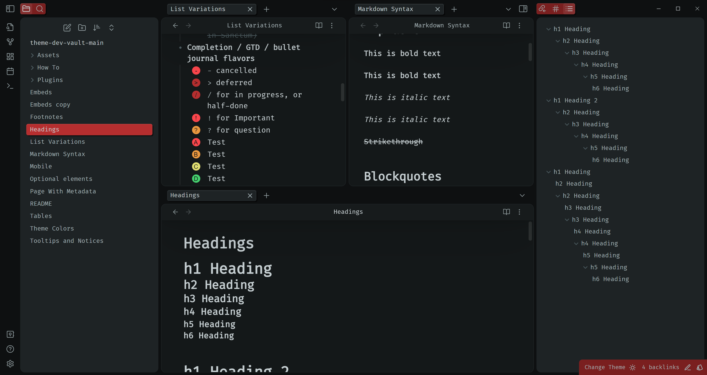
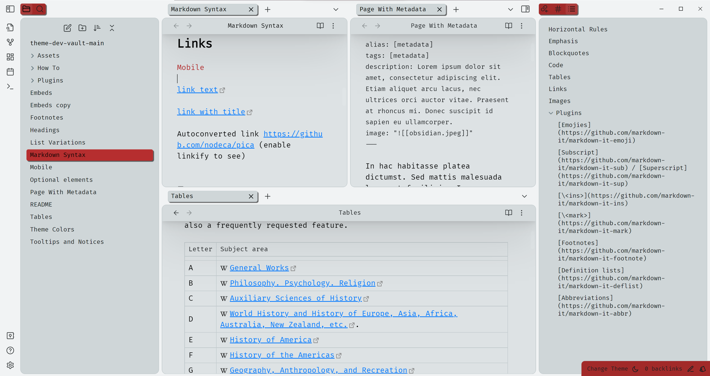

<h1>Solitude</h1>

    Designed by
    <a href="https://github.com/MajorEnkidu">MajorEnkidu</a>
     | License:
    <a href="https://github.com/MajorEnkidu/solitude-vscode-theme/blob/main/LICENCE.md">MIT</a>

Solitude is a modern looking [Obsidian](https://obsidian.md/) theme for desktop, mobile and tablet. You can customize it and enable some extra features via the [Style Settings](https://github.com/mgmeyers/obsidian-style-settings) plugin.

 

    

 

## About Solitude

- [About Solitude](#about-solitude)
- [Screenshots](#screenshots)
  - [Dark mode](#dark-mode)
  - [Light mode](#light-mode)
- [Extra Features](#extra-features)
- [Alternate Checkboxes](#alternate-checkboxes)
- [Recommended Plugins](#recommended-plugins)
- [Roadmap](#roadmap)
- [Changelog](#changelog)
- [Bugs / Issues](#bugs--issues)

## Screenshots

### Dark mode

### Light mode

## Extra Features

- Colored "A, B, C, D" - checkboxes (Useful for prioritizing tasks)
- Custom background color settings
- Custom workspace background image

## Alternate Checkboxes

| Syntax   | Description |
| -------- | ----------- |
| `- [ ]`  | to-do       |
| `- [/]`  | incomplete  |
| `- [x]`  | done        |
| `- [-]`  | canceled    |
| `- [>]`  | deferred   |
| `- [<]`  | scheduling  |
| `- [?]`  | question    |
| `- [!]`  | important   |
| `- [A]` | prioritize |
| `- [B]` | prioritize |
| `- [C]` | prioritize |
| `- [D]` | prioritize |

## Recommended Plugins

- [Style Settings](https://github.com/mgmeyers/obsidian-style-settings)

## Roadmap

| Planed  | Working on | Done |
|---|---|---|
|  Better icons |  | README improvements |
|  Better animations | | Link improvements |
|  More customizations | | |

## Changelog

- v1.0.0 Initial Theme creation
- v2.0.0 First Release
- v2.2.0 Bugfixes (Buttons and workspace background)
- v2.2.1 Bugfix: old folder icon wasn't removed
- v2.3.0 Major bugfixes after update & some additional settings were added
- v2.4.0 Redone ribbons & statusbar
- v2.5.0 Redone modals
- v2.6.0 Redone shadows & file explorer
- v2.7.0 Redone suggestion prompt
- v2.7.4 Major fix after obsidian v1.0.0
- v2.7.5 Added custom background feature, file icon in the tab header of the side panels show first letter now
- v2.7.6 Added some mobile optimizations
- v2.7.7 Quick bugfix
- v2.7.8 Some changes to the README and the promo screenshot
- v2.7.9 Changed the back arrow in mobile view & added a color picker to background colors
- v2.8.0 Rebranding to "Solitude"
- v2.8.1 Rework on: Tabs, spacing, settings, light theme, bugfixes
- v2.8.2 Bugfixes & new shadows
- v2.8.3 Bugfixes
- v2.8.4 Bugfixes, README improvements, Link improvements

## Bugs / Issues

    Please open an <a href="https://github.com/MajorEnkidu/solitude-obsidian-theme/issues">issue on github</a>, if you find any bugs or if you have any recommendations for what I should add to this theme.

