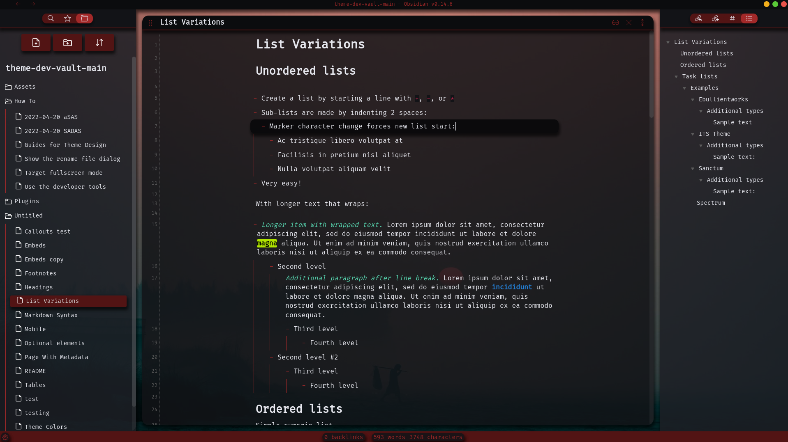
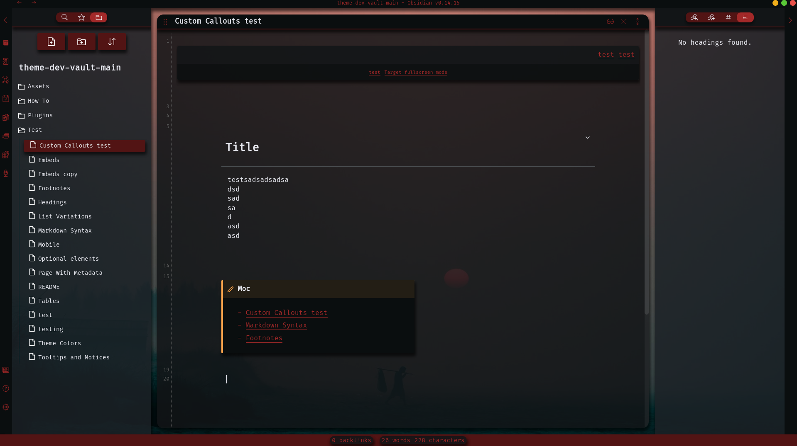

# Red Solitude

    Designed by
    <a href="https://github.com/MajorEnkidu">MajorEnkidu</a>
     | License:
    <a href="https://github.com/MajorEnkidu/red-solitude-vscode-theme/blob/main/LICENCE.md">MIT</a>

    

**_I am currently working on a complete overhaul of the theme, in order to make it work with obsidian v1.0.0. This could take quite some time, as I have quite a full week, so please be patient; it will be worth it._**

## Description

This is going to be a dark theme with a 3D look, which uses your chosen accent color. It will have many extra functions (if you use the below mentioned snippets) and is highly configurable via the [Style Settings](https://github.com/mgmeyers/obsidian-style-settings) plugin.

## Planed Extra Features (Not yet working due to the obsidian v1.0.0 update)

- Custom workspace background
- Translucent panels (Only useful if a custom background is used)
- Active line effect
- Hover over line effect
- Custom callouts
  - Heading callout (callout tag: "h") such that whole sections under the heading can be folded via callout fold arrows
  - MOC callout (callout tag: "moc") such that a wiki like, left aligned, moc can be created
  - Controls callout (callout tag: "ctrl") for use as a ctrl-buttons header (Work in progress)
- Exportmode (Work in progress)

Theme with translucency enabled and a custom background defined via a snippet. Here you can also see the before mentioned custom callouts.

## Recommended Plugins

- [Style Settings](https://github.com/mgmeyers/obsidian-style-settings)

## Changelog

- v1.0.0 Initial Theme creation
- v2.0.0 First Release
- v2.2.0 Bugfixes (Buttons and workspace background)
- v2.2.1 Bugfix: old folder icon wasn't removed
- v2.3.0 Major bugfixes after update & some additional settings were added
- v2.4.0 Redone ribbons & statusbar
- v2.5.0 Redone modals
- v2.6.0 Redone shadows & fileexplorer
- v2.7.0 Redone suggestion prompt
- v2.7.4 Major fix after obsidian v1.0.0

    Please open an <a href="https://github.com/MajorEnkidu/red-solitude-obsidian-theme/issues">issue</a> on github, if you find any bugs or if you have any recommendations for what I should add to this theme.

